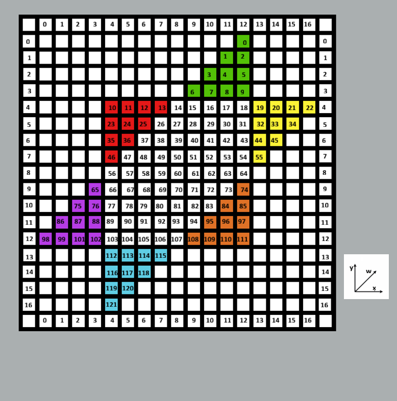

# Parallel_Chinese_Checkers_Engine

The goal of this project is to create a Chinese Checkers engine that can work with up to 6 players in the game with speed and accuracy. There are also parallelized implementations using the [Lazy SMP](https://www.chessprogramming.org/Lazy_SMP) method. Currently, the code can be compiled with GCC 23 or later, which can just be done by cloning the repo and using the makefile. Below, the techniques used are outlined and explained.

# Representing the board

The Chinese Checkers board is represented both with bitboards and 2D Arrays. The bitboards allow for fast runtime operations and the arrays can be used to precompute tables.

## 2D Arrays

A Chinese Checkers board may seem tricky to represent in a matrix because the game is played on a hex grid rather than a traditional gridworld like chess and checkers. This means that there are 6 degrees of freedom, a piece has 6 directions to move in. This hex grid can be represented in a 2D array by defining axes on both domains and translating, as seen below:

We have defined the x,y, and w axes on the right. By defining the w axis on the 2D grid as 1 move in the x direction and 1 move in the y direction, we can translate in all 3 directions despite being on the 2D matrix. For example, we can see on the right that the top left green marble is 12 spaces away from the bottom purple marble on the w axis. By starting at that same purple sapce on the left and moving 12 spaces diagonally in the w direction on the grid, we can move between those same two marbles in both domains.

## Bitboards

In chess engines, a [bitboard](https://www.chessprogramming.org/Bitboards) refers to a 64-bit value where each bit represents one square of the 64 square (8x8) chess board. It is simple to calculate the corresponding rank and file (row and column) of a bit given the symmetric nature of the chess board. Chinese checkers does not have these same convienences, with the board having more than 64 spaces and not being an 8x8 grid. The board has 121 spaces, so we can use a 128-bit value to represent it. We have mapped each space to a bit:

In this example, the bitboard representing the green player's marbles would have bits 0-9 set and the blue player's would have bits 111-120 set. If we did a bitwise AND of the bitboard of each player's pieces, the result would be a bitboard where each set bit represents a marble on that space. Bitboards allow for faster operations than exploring a grid.

# Precomputed Tables

# Move Generation

# Pessimistic Alpha-Beta Minimax Search

# Transposition Table

# Lazy SMP
